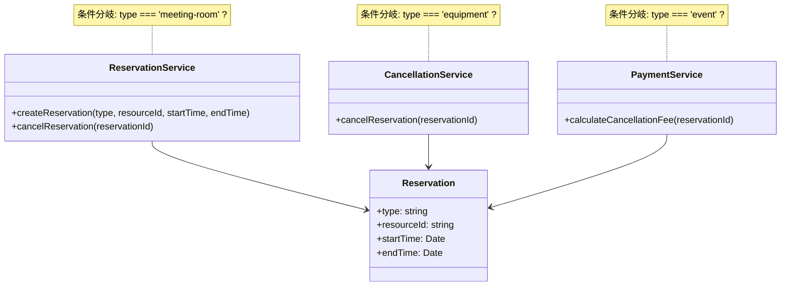
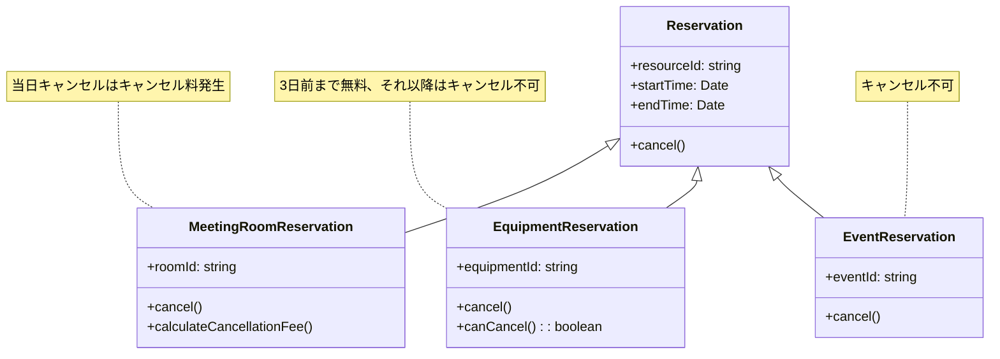
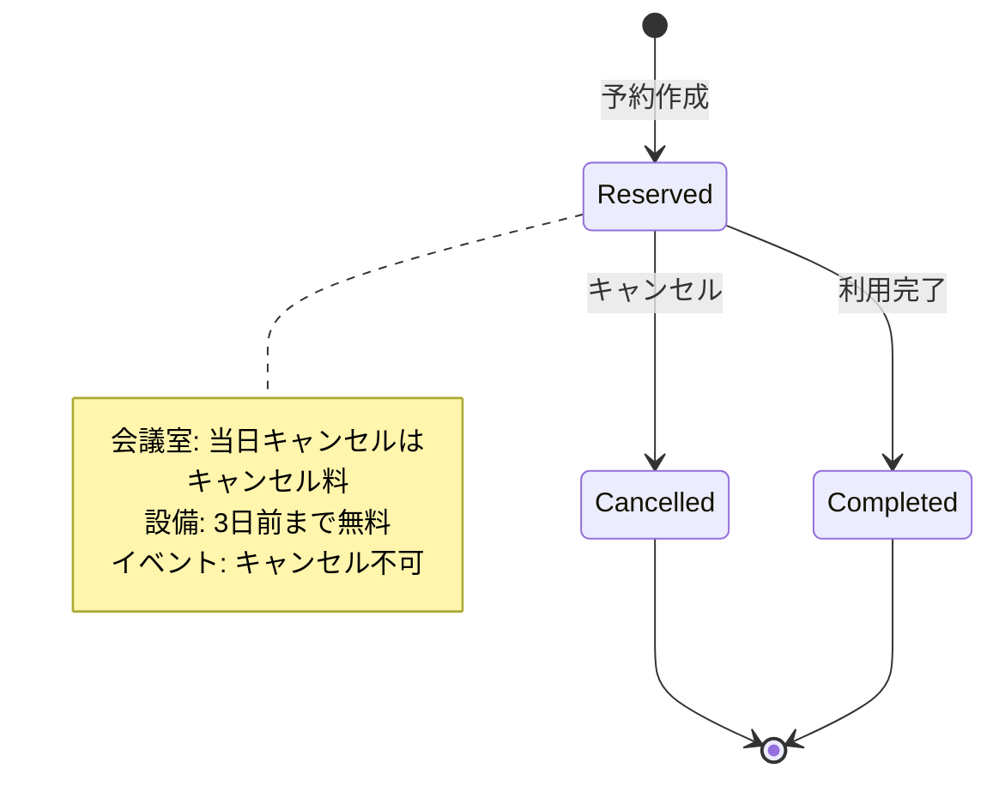

機能は動いている。テストも通っている。エンジニアも真面目にやっている。
それなのに、新しい機能を追加しようとすると、なぜか全体を見直す必要が出てくる。

実際に開発を進めていると、こういう経験をしたことがある人もいると思います。
「動いている」と「変更できる」は、実は別物なのかもしれない。

この違和感の正体は、設計が壊れているからではありません。
設計が「現実を説明できなくなっている」からです。

## 予約システムの成長過程

例えば、会議室予約システムを考えてみましょう。

最初は会議室の予約だけでした。シンプルで、問題も起きません。

```javascript
// ReservationService.js
function createReservation(roomId, startTime, endTime) {
  // 会議室を予約
}

function cancelReservation(reservationId) {
  // 予約をキャンセル
}
```

やがて「設備も予約できるようにしたい」という要件が出てきました。
会議室と設備、どちらも「予約」だから同じように扱えるはずです。
条件分岐を追加して対応しました。

```javascript
// ReservationService.js
function createReservation(type, resourceId, startTime, endTime) {
  if (type === 'meeting-room') {
    // 会議室の予約処理
  } else if (type === 'equipment') {
    // 設備の予約処理
  }
}

function cancelReservation(reservationId) {
  const reservation = getReservation(reservationId);
  if (reservation.type === 'meeting-room') {
    // 会議室のキャンセル処理
  } else if (reservation.type === 'equipment') {
    // 設備のキャンセル処理
  }
}
```

次に「イベント予約」が追加されました。さらに条件分岐が増えます。

```javascript
function cancelReservation(reservationId) {
  const reservation = getReservation(reservationId);
  if (reservation.type === 'meeting-room') {
    // 会議室のキャンセル処理
  } else if (reservation.type === 'equipment') {
    // 設備のキャンセル処理
  } else if (reservation.type === 'event') {
    // イベントのキャンセル処理
  }
}
```

それぞれの機能は動いています。でも、新しい予約タイプを追加するたびに、
既存のコードのあちこちを触る必要が出てきます。

なぜか？設計が「機能」で分かれていて、
実際のビジネスの違い（会議室、設備、イベント）を
そのまま表現できていないからです。

機能単位で分けた設計は、変更が「振る舞いの追加」ではなく
「条件の追加」になる構造を作ります。

条件が増えるということは、

- 影響範囲がコード上に現れない
- ルールが分散する
- なぜその条件があるのかが消える

という状態を生みます。

## 動いているが変更できない構造

さらに問題が起きます。キャンセルポリシーが予約タイプによって違うのです。

- 会議室：当日キャンセルはキャンセル料が発生
- 設備：3日前まで無料キャンセル、それ以降はキャンセル不可
- イベント：キャンセル不可

でも、設計はこれを表現できていません。条件分岐が複雑になっていく。

```javascript
// ReservationService.js
function cancelReservation(reservationId) {
  const reservation = getReservation(reservationId);
  
  if (reservation.type === 'meeting-room') {
    if (isSameDay(reservation.startTime)) {
      // 当日キャンセル料の処理
    }
    // 会議室のキャンセル処理
  } else if (reservation.type === 'equipment') {
    if (isWithin3Days(reservation.startTime)) {
      // 3日前まで無料キャンセル
    } else {
      throw new Error('キャンセル不可');
    }
  } else if (reservation.type === 'event') {
    throw new Error('キャンセル不可');
  }
}
```

やがて、コードが複数のファイルに散らばっていきます。

```javascript
// ReservationService.js
function createReservation(type, resourceId, startTime, endTime) {
  // 予約作成処理
}

// CancellationService.js
function cancelReservation(reservationId) {
  // キャンセル処理（条件分岐が複雑）
}

// PaymentService.js
function calculateCancellationFee(reservationId) {
  const reservation = getReservation(reservationId);
  if (reservation.type === 'meeting-room') {
    // 会議室のキャンセル料計算
  } else if (reservation.type === 'equipment') {
    // 設備のキャンセル料計算
  }
  // イベントはここに来ない（でも、なぜ来ないのか分からない）
}
```

「動いている」けれど、「変更するたびに全体を見直す必要がある」設計です。

新しい予約タイプを追加しようとすると、
`ReservationService.js`、`CancellationService.js`、`PaymentService.js`など、
複数のファイルを同時に修正する必要が出てきます。
影響範囲が分からず、変更が怖くなります。

「この条件分岐、どこまで影響するんだろう？」
「このファイルを触ったら、他のファイルも直さないといけないのかな？」
そんな不安が頭をよぎることもあります。

## なぜこの問題が起きるのか

多くの場合、最初は「動くこと」だけを重視していたのではないでしょうか。
ビジネスが成長し、機能が増え、人が増える。
そのとき、設計が「現実の動き」を説明できなくなっていることに気づきます。

予約システムの場合、設計が「機能」で分かれていると、
ビジネスの「違い」（会議室、設備、イベント）を表現できません。
結果として、変更のたびに全体を見直す必要が出てきます。

設備予約やイベント予約を追加したとき、
「会議室とは何か」「設備とは何か」というビジネスの意味を設計に反映できませんでした。
その結果、条件分岐で対応することになり、変更のたびに影響範囲が分からなくなります。

キャンセルポリシーが予約タイプによって違うのに、
設計はそれを表現できていません。その結果、各ファイルで条件分岐が散らばり、
「この変更、他のファイルにも影響するのかな？」と不安になります。

## 判断の視点

判断の視点として、以下のチェックリストで確認してみてください：

- [ ] **この設計で、実際のビジネスを説明できますか？**
  - [ ] 会議室、設備、イベントの違いを、設計から読み取れますか？
  - [ ] キャンセルポリシーの違いを、設計から読み取れますか？

- [ ] **変更が必要になったとき、影響範囲を把握できますか？**
  - [ ] 新しい予約タイプを追加するとき、どこを触ればいいか分かりますか？
  - [ ] 複数のファイルに散らばった条件分岐を、全部見つけられますか？

- [ ] **設計の意図を、後から参加した人に説明できますか？**
  - [ ] なぜこの条件分岐があるのか、理由を説明できますか？
  - [ ] なぜこのファイルにこの処理があるのか、理由を説明できますか？

チェックがつかない項目があるなら、それは「動いている」けれど「変更できない」設計かもしれません。

では、どうすれば「変更できる」設計になるのでしょうか。いきなり完璧な設計を目指すのではなく、
「違いが見えるようにする」くらいのモデリングから始めるのが良いでしょう。

## 小さくモデリングしてみる

ここでは、予約システムの例を使って、モデリングの方法を考えてみましょう。

### 現状の問題を可視化する

まず、現状の設計をUMLで可視化してみましょう。



この図から分かることは：

- `Reservation`の`type`が文字列で、違いが表現できていない
- 各Serviceで条件分岐が散らばっている
- 新しい予約タイプを追加するとき、複数のServiceを同時に修正する必要がある

### 違いを型で表現する

改善案として、予約タイプの違いを型やクラスで表現してみましょう。



この図から分かることは：

- 予約タイプの違いが、クラスの違いとして表現されている
- キャンセルポリシーの違いが、各クラスのメソッドで表現されている
- 新しい予約タイプを追加するとき、新しいクラスを追加するだけで良い

### コードで表現する

UMLで見た改善案を、コードで表現してみましょう。

```javascript
// 基底クラス
class Reservation {
  constructor(resourceId, startTime, endTime) {
    this.resourceId = resourceId;
    this.startTime = startTime;
    this.endTime = endTime;
  }
  
  cancel() {
    throw new Error('cancel() must be implemented');
  }
}

// 会議室予約
class MeetingRoomReservation extends Reservation {
  cancel() {
    if (this.isSameDay()) {
      // 当日キャンセル料の処理
      this.chargeCancellationFee();
    }
    // キャンセル処理
  }
  
  calculateCancellationFee() {
    // 会議室のキャンセル料計算
  }
}

// 設備予約
class EquipmentReservation extends Reservation {
  cancel() {
    if (!this.canCancel()) {
      throw new Error('キャンセル不可');
    }
    // キャンセル処理
  }
  
  canCancel() {
    return this.isWithin3Days();
  }
}

// イベント予約
class EventReservation extends Reservation {
  cancel() {
    throw new Error('キャンセル不可');
  }
}
```

:::message
ここでは説明のためにクラスで表現していますが、
重要なのは「型や責務の単位で違いを閉じ込める」ことであり、
実装手法そのものではありません。
interfaceやcomposition、strategyパターンなど、他の実装手法でも同じ考え方を適用できます。
:::

このコードから分かることは：

- 条件分岐が減り、各クラスに責任が集約されている
- 新しい予約タイプを追加するとき、新しいクラスを追加するだけで良い
- キャンセルポリシーの違いが、各クラスの`cancel()`メソッドで表現されている

### 状態遷移も可視化する

予約の状態遷移も、UMLで可視化してみましょう。



この図から分かることは：

- 予約の状態遷移が明確になっている
- キャンセルポリシーの違いが、注釈で表現されている
- 状態遷移のルールが、設計から読み取れる

### モデリングのポイント

この例で示したように、モデリングのポイントは：

1. **違いを型で表現する**
   - 文字列の`type`ではなく、クラスや型で違いを表現する
   - 条件分岐を減らし、各クラスに責任を集約する

2. **状態遷移を可視化する**
   - 予約の状態遷移を図で表現する
   - ビジネスルールを注釈で補足する

3. **小さく始める**
   - いきなり完璧な設計を目指さない
   - 「違いが見える」状態から始める

完璧な設計を目指すのではなく、「違いが見える」状態にすることが、変更できなくなる設計を避ける第一歩です。

## まとめ

「動いている」と「変更できる」は別物です。
設計が現実を説明できなくなったとき、変更は難しくなります。

予約システムの例で見たように、
機能単位で設計すると、ビジネスの「違い」（会議室、設備、イベント）を表現できなくなります。
条件分岐で対応することになり、変更のたびに影響範囲が分からなくなります。

複数のファイルに散らばった条件分岐は、
「この変更、他のファイルにも影響するのかな？」という不安を生みます。
設計がビジネスの意味を表現できていないからです。

変更できる設計を目指す場合は、
「この設計で、実際のビジネスを説明できるか」
という問いから始めてみると良いでしょう。
